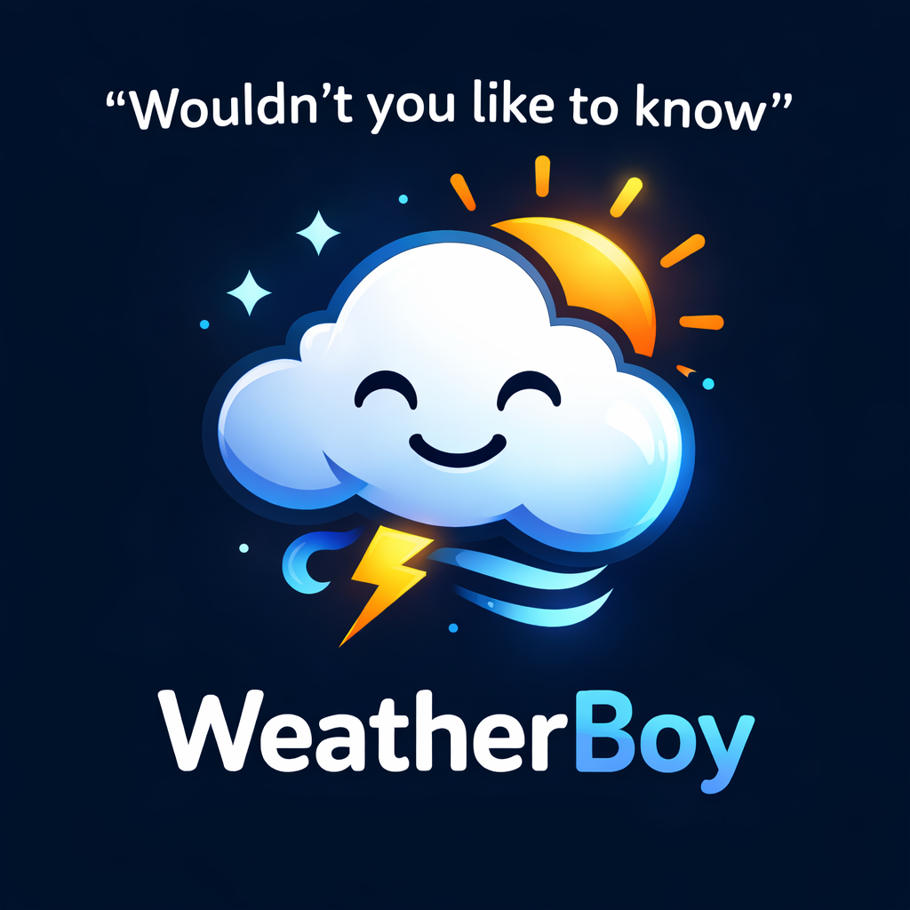

## Introduction

[](https://opensource.org/licenses/MIT)

envdash is a REST API service designed to provide airquality and general information about countries.

## Authors

This code was developed by:

* [Bror Wetlesen Vedeld] [@[BroVed]]([profile-link])
* [Lennart Krogh] [@[Lennart]]([profile-link])
* [Robin Jahre] [@[robinja]]([profile-link])

## Features

* User registration
* Provides API keys
* Allows registration and generation of Dashboard configurations
* Multilayer cache 
* Wrapper that can access external APIs

## Tech Stack
## Tech Stack
- [Go](https://go.dev/)
- [Restcountries](http://129.241.150.113:8080/)
- [OpenAQ](https://docs.openaq.org/)
- [Openmeteo](https://open-meteo.com/)
- [Restcurrencies](http://129.241.150.113:9090/currency/)
- [Firestore](https://firebase.google.com/docs/firestore)

## Project structure 
This section outlines the base structure of the project, details about the implementation of these components are in the docs folder: [docs](./docs).
In the docs folder we will also discuss tradeoffs and the like, if you are evaluating the project for a grade, you should definitely  check it out. 
```
assignment-2/
├── .gitignore
├── .gitmessage
├── go.mod
├── go.sum
├── LICENSE
├── README.md
├── requests.log
├── .idea/
│   ├── .gitignore
│   ├── assignment-2.iml
│   ├── modules.xml
│   ├── vcs.xml
│   └── workspace.xml
├── cmd/
│   └── envdash/
│       ├── main.go
│       └── requests.log
├── docs/
│   ├── Authentication.md
│   ├── GitHygiene.md
│   ├── SecretHandling.md
│   └── devutils/
│       ├── gitmessage.txt
│       └── setup-commit-template.sh
└── internal/
    ├── client/
    │   ├── currency/
    │   │   ├── client.go
    │   │   ├── client_flaky_test.go
    │   │   └── client_test.go
    │   ├── openaq/
    │   │   ├── client.go
    │   │   ├── client_flaky_test.go
    │   │   └── client_test.go
    │   ├── openmeteo/
    │   │   ├── client.go
    │   │   ├── client_flaky_test.go
    │   │   └── client_test.go
    │   └── restcountries/
    │       ├── client.go
    │       ├── client_flaky_test.go
    │       └── client_test.go
    ├── handlers/
    │   ├── authentication.go
    │   ├── dashboard.go
    │   ├── defaultHandler.go
    │   ├── handler.go
    │   ├── middleware.go
    │   ├── notification.go
    │   ├── registration.go
    │   ├── status.go
    │   ├── status_http_test.go
    │   ├── status_main_test.go
    │   └── status_stub_test.go
    ├── models/
    │   ├── authentication.go
    │   ├── dashboard.go
    │   ├── errorresponse.go
    │   ├── notification.go
    │   └── registration.go
    ├── store/
    │   ├── cache.go
    │   ├── cache_http_test.go
    │   ├── cache_main_test.go
    │   ├── cache_stub_test.go
    │   └── firestore.go
    └── utils/
        ├── constants.go
        ├── http.go
        └── logger.go
```

### cmd
cmd contains the main.go file for running the project
### internal
Internal contains most of the files used in the project. These are files that will not be accesible outside the go module developed in the project.
Meaning if you include this in go.mod the internals will not be exposed. 
#### client
Client contains all the api wrappes for external apis, as their own separate packages with their own tests. 
These are only touched by the local cache and the status endpoint

#### handlers 
These files contains the endpoints as well as tests for these endpoints. 

#### models
These contains modular files that contain variables used by multiple files

#### store
Store contains the local cache as well as the logic required to connect to firestore

#### Utils
Utils contains the http client factory as well as the logic for the logger.

## API Implementation

* **Language:** Go

### Deployment

Project is hosted on NTNU Openstack: [Envdash endpoint](http://10.212.172.108:8080/)

Must be connected to NTNU Internal Network to access.

- **Platform:** OpenStack
- **Containerization:** Docker Compose
    - **Description:** Services are containerized using Docker Compose to facilitate easy deployment and scaling.

## API Reference / Documentation
<details>
<summary> <h4> Acquire Api Key </h4> </summary>

Simply **POST** your name and email in JSON format to `/envdash/v1/auth/`

Example URL:
`POST xxxxx:8080/envdash/v1/auth/`
Body:
``` json
{
  "name": "Alice",
  "email": "alice@mail.com"
}
```
| Parameter      | Type  | Description                       |
|:-----------|:------------|:----------------------------    |
| `name`     | `string`    | *Required*                      |
| `email`    | `string`    | *Required*. Need to contain "@" |


#### Response:

| Status Code | Content-Type       |
| :---------- | :----------------- |
| `201 Created`    | `application/json` |


You will then receive an API key:
``` json
{
  "key": "sk-envdash-YourAPIkey...",
  "createdAt": "20260317 20:32"
}
```

| Fields      | Description                 |
|:----------- |:----------------------------|
| `key`       | Your personal API key  |
| `createdAt` | When the API key was created     |


</details>


<details>
<summary> <h4> Delete Api Key </h4> </summary>

Simply **DELETE** your api key using api you want to delete in url `/envdash/v1/auth/{apiKey}` 

Example URL:
`DELETE xxxxx:8080/envdash/v1/auth/sk-envdash-YourAPIkey`

| Header      | Value: Type | Description                 |
|:-----------|:------------|:----------------------------|
| `X-API-Key` | {YourAPIkey}       | Needs to be an api key from the same user. You have to be allowed to delete the key. You can delete your own key as well |


#### Response:

| Status Code   |
|:--------------|
| `204 No Content` |

When you get the 204, you know that the api key is deleted.
If you receive any other status code, the API key was not deleted.
You will get a helpful error message, try using that to understand
why the key cant be deleted.

</details>

<details>
<summary><h4>Check Status of Service: (Firestore, independent third party API, Version, Uptime)</h4></summary>

```http
  GET /envdash/v1/status/
```


#### Response:

| Status Code  | Content-Type       |
|:-------------|:-------------------|
| `200 OK`     | `application/json` |

```json
{
    "CountriesAPI": "Status of the REST Countries API",
    "MeteoAPI": "Status of the Open-Meteo API",
    "OpenAQAPI": "Status of the OpenAq API",
    "CurrencyAPI": "Status of the REST Currency API",
    "NotificationDB": "Status of the Notification database",
    "webhooks": "Number of webhooks registered",
    "version": "API Version",
    "uptime": "Time since last server reboot (In Seconds)"
}
```

</details>

<details>
<summary><h4>Register a Country to get information for:</h4></summary>

```http
POST /envdash/v1/registrations/
```

| Header          | Type     | Description                |
|:----------------|:---------|:---------------------------|
| `X-API-Key`     | `string` | **Required**. Your API key  |

#### Example Request Body:

```json
{
    "country": "Norway",
    "isoCode": "NO",
    "features": {
        "temperature": true,
        "precipitation": true,
        "capital": true,
        "coordinates": true,
        "population": true,
        "area": true,
        "targetCurrencies": ["JPY", "usd", "EUR"]
    }
}
```

> `country` and `isoCode` are case-insensitive. At least one must be provided. If both are provided, they must match.
> `targetCurrencies` is case-insensitive. Maximum 10 currencies.

#### Response:

| Status Code   | Content-Type       |
|:--------------|:-------------------|
| `201 Created` | `application/json` |

```json
{
    "id": "your-registration-id",
    "lastChange": "20060102 15:04"
}
```

</details>

<details>
<summary><h4>Retrieve all registered countries:</h4></summary>

```http
GET /envdash/v1/registrations/
```

| Header      | Type     | Description                |
|:------------|:---------|:---------------------------|
| `X-API-Key` | `string` | **Required**. Your API key |

#### Response:

| Status Code | Content-Type       |
|:------------|:-------------------|
| `200 OK`    | `application/json` |

```json
[
    {
        "id": "your-registration-id",
        "country": "Norway",
        "isoCode": "NO",
        "features": {
            "temperature": true,
            "precipitation": true,
            "capital": true,
            "coordinates": true,
            "population": true,
            "area": true,
            "targetCurrencies": ["JPY", "USD", "EUR"]
        },
        "lastChange": "20060102 15:04"
    }
]
```

</details>

<details>
<summary><h4>Retrieve a specific registered country:</h4></summary>

```http
GET /envdash/v1/registrations/{ID}
```

| Parameter / Header | Type     | Description                       |
|:-------------------|:---------|:----------------------------------|
| `X-API-Key`        | `string` | **Required**. Your API key    (HEADER)      |
| `ID`               | `string` | **Required**. Your registration ID |

#### Response:

| Status Code | Content-Type       |
|:------------|:-------------------|
| `200 OK`    | `application/json` |

```json
{
    "id": "your-registration-id",
    "country": "Norway",
    "isoCode": "NO",
    "features": {
        "temperature": true,
        "precipitation": true,
        "capital": true,
        "coordinates": true,
        "population": true,
        "area": true,
        "targetCurrencies": ["JPY", "USD", "EUR"]
    },
    "lastChange": "20060102 15:04"
}
```

</details>

<details>
<summary><h4>Replace a registered country:</h4></summary>

```http
PUT /envdash/v1/registrations/{ID}
```

| Parameter / Header | Type     | Description                        |
|:-------------------|:---------|:-----------------------------------|
| `X-API-Key`        | `string` | **Required**. Your API key   (HEADER)        |
| `ID`               | `string` | **Required**. Your registration ID |

#### Example Request Body:

```json
{
   "country": "Norway",
   "isoCode": "NO",
   "features": {
      "temperature": true,
      "precipitation": true,
      "airQuality": true,
      "capital": true,
      "coordinates": true,
      "population": true,
      "area": true,
      "targetCurrencies": ["EUR", "USD", "SEK"]
   },
}


```

#### Response:

| Status Code | Content-Type       |
|:------------|:-------------------|
| `200 OK`    | `application/json` |

Returns the updated registration object.

</details>

<details>
<summary><h4>Partially update a registered country:</h4></summary>

```http
PATCH /envdash/v1/registrations/{ID}
```

| Parameter / Header | Type     | Description                        |
|:-------------------|:---------|:-----------------------------------|
| `X-API-Key`        | `string` | **Required**. Your API key   (HEADER)        |
| `ID`               | `string` | **Required**. Your registration ID |

#### Example Request Body (all fields optional):

```json
{
    "country": "Sweden",
    "isoCode": "SE",
    "features": {
        "temperature": false,
        "targetCurrencies": ["EUR"]
    }
}
```

#### Response:

| Status Code      |
|:-----------------|
| `204 No Content` |

</details>

<details>
<summary><h4>Delete a registered country:</h4></summary>

```http
DELETE /envdash/v1/registrations/{ID}
```

| Parameter / Header | Type     | Description                        |
|:-------------------|:---------|:-----------------------------------|
| `X-API-Key`        | `string` | **Required**. Your API key    (HEADER)       |
| `ID`               | `string` | **Required**. Your registration ID |

#### Response:

| Status Code      |
|:-----------------|
| `204 No Content` |

</details>

<details>
<summary><h4>Get dashboard data for a registered country:</h4></summary>

```http
GET /envdash/v1/dashboards/{ID}
```

| Parameter / Header | Type     | Description                        |
|:-------------------|:---------|:-----------------------------------|
| `X-API-Key`        | `string` | **Required**. Your API key   (HEADER)        |
| `ID`               | `string` | **Required**. Your registration ID |

#### Response:

| Status Code | Content-Type       |
|:------------|:-------------------|
| `200 OK`    | `application/json` |

```json
{
    "country": "Norway",
    "isoCode": "NO",
    "features": {
        "temperature": 5.3,
        "precipitation": 12.1,
        "capital": "Oslo",
        "coordinates": [60.472, 8.4689],
        "population": 5379475,
        "area": 323802.0,
        "targetCurrencies": {
            "JPY": 14.23,
            "USD": 0.09,
            "EUR": 0.085
        },
        "airQuality": {
            "pm25": 10.0,
            "pm10": 20.0,
            "level": "good"
        }
    },
    "lastRetrieval": "20060102 15:04"
}
```

> `airQuality` is only included if air quality data is available. `level` is one of: `good`, `moderate`, `unhealthy for sensitive groups`, `unhealthy`, `hazardous`.
---
</details>

<details>
<summary><h4>Interactive API Documentation</h4></summary>

Simply **GET** the documentation page at `/envdash/v1/docs`

Example URL:
`GET xxxxx:8080/envdash/v1/docs`

-Body empty-

#### Response:

| Status Code | Content-Type |
|:------------|:-------------|
| `200 OK`    | `text/html`  |

This endpoint serves an interactive documentation page for the Envdash Application Programming Interface (API).

The page renders the OpenAPI Specification (OAS) automatically in the browser using Swagger UI, and allows you to:

- inspect all available endpoints
- view request and response schemas
- test endpoints directly from the browser

#### Notes:

- If the documentation endpoint is public, it can be opened directly in a browser.
- If the documentation endpoint is protected, you must be authenticated before accessing it.
- The underlying OpenAPI specification is used internally by the documentation page and does not need to be called manually in normal use.

</details>

<details>
<summary><h4> Create Notification </h4></summary>

Simply **POST** your notification query with correct body `/envdash/v1/notifications/`

|  Header | Type     | Description                        |
|:-------------------|:---------|:-----------------------------------|
| `X-API-Key`        | `string` | **Required**. Your API key        |

```http
POST /envdash/v1/notifications/
```
Body:
We have two type of notifications, lifecycle and threshold:
````json
{
   "url":     "https://webhook.site/your-unique-URL",
   "country": "NO",
   "event":   "INVOKE"
}
````

````json
{
   "url":     "https://webhook.site/your-unique-URL",
   "country": "NO",
   "event":   "THRESHOLD",
   "threshold": {
      "field":    "pm25",
      "operator": ">",
      "value":    35.0
   }
}
````


#### Parameters:

| Parameter      | Type  | Description                       |
|:-----------|:------------|:----------------------------    |
| `url`     | `string`    | *Required* URL to where you want your notification                     |
| `country`    | `string`    | *Optional*  2 letter country code ([lookup here](https://datahub.io/core/country-list)). Omit or leave empty to match all countries|
| `event`     | `string`    | *Required* One of: `REGISTER`, `CHANGE`, `DELETE`, `INVOKE`, `THRESHOLD`                    |


| Event | Triggered when… |
|-------|-----------------|
| `REGISTER` | A new dashboard configuration is registered (`POST /registrations/`) |
| `CHANGE` | A configuration is updated (`PUT` or `PATCH /registrations/{id}`) |
| `DELETE` | A configuration is deleted (`DELETE /registrations/{id}`) |
| `INVOKE` | A populated dashboard is retrieved (`GET /dashboards/{id}`) |
| `THRESHOLD` | A live measured value crosses a user-defined threshold during dashboard retrieval |

For threshold notificatoins:
| Parameter      | Type  | Description                       |
|:-----------|:------------|:----------------------------    |
| `threshold.field`  | `string`    | *Required* Field to monitor: `pm25` \| `pm10` \| `temperature` \| `precipitation`                   |
| `threshold.operator`| `Comparison operator`    | *Required*  Comparison operator: `>`, `<`, `>=`, `<=`, `==` |
| `threshold.value`  | `string`    | *Required* Numeric threshold value        |


#### Response:

| Status Code      |
| :--------------- |
| `201 Created` |
Body:

````json
{
    ìd:   "IdOfYourNotifcation",
}
````

You have now created a notfication, it will send a webhook when the
event you registered is fulfilled

</details>

--- 

<details>
<summary><h4> Retrieve a Specific Webhook  </h4></summary>

Simply **GET** your notifcation by `/envdash/v1/notifications/{ID_Of_Notifcation}`

Example URL:
`GET xxxxx:8080/envdash/v1/notifications/uUmLcayWY9WgGL26ASDp`

|  Header | Type     | Description                        |
|:-------------------|:---------|:-----------------------------------|
| `X-API-Key`        | `string` | **Required**. Your API key        |

-Body empty-

#### Response:

Header:

| Status Code | Content-Type       |
| :---------- | :----------------- |
| `200 OK`    | `application/json` |


Body:
``` json
{
    "id": "ID_Of_Notifcation",
    "url": "https://webhook.site/your-unique-URL",
    "country": "NO",
    "event": "THRESHOLD",
    "threshold": {
        "field": "PM25",
        "operator": "==",
        "value": 35
    }
}
```

[Notification fields can be found:](./docs/notification.md)

</details>

---
[Authentication](./docs/Authentication.md)
[Notifications system](./docs/notification.md)

<details>
<summary> <h4> List All Your Registered Webhooks </h4> </summary>

Simply **GET** `/envdash/v1/notifications/`

Example URL:
`GET xxxxx:8080/envdash/v1/notifications/`

|  Header | Type     | Description                        |
|:-------------------|:---------|:-----------------------------------|
| `X-API-Key`        | `string` | **Required**. Your API key |

-Body empty-

#### Response:

| Status Code | Content-Type       |
| :---------- | :----------------- |
| `200 OK`    | `application/json` |


You will now see every notification registered to your account
``` json
{
[
    {
        "id": "ID_Of_Notifcation",
        "url": "https://webhook.site/your-unique-URL",
        "country": "NO",
        "event": "CHANGE"
    },
    {
        "id": "Another_ID_Of_Notifcation",
        "url": "https://webhook.site/your-unique-URL",
        "country": "NO",
        "event": "DELETE"
    }
]
}
```

[Notification fields can be found:](./docs/notification.md)


| Fields      | Description                 |
|:----------- |:----------------------------|
| `key`       | Your personal API key  |
| `createdAt` | When the API key was created     |

</details>

---


<details>

<summary> <h4> Delete Notification </h4> </summary>

Simply **DELETE** your notification `/envdash/v1/notifications/{NotificationID}`

Example URL:
`DELETE xxxxx:8080/envdash/v1/notifications/6pSNoPNL08oroGqRWoAR`

|  Header | Type     | Description                        |
|:-------------------|:---------|:-----------------------------------|
| `X-API-Key`        | `string` | **Required**. Your API key        |

-Body empty-

#### Response:

| Status Code | Content-Type       |
| :---------- | :----------------- |
| `204 No Content`    | `application/json` |

You have now deleted your notification.
Remember, you can not delete someone else's notification
This is decided on your api key you use in header.

</details>

---


## Prerequisites

- An [OpenAQ API key](https://docs.openaq.org/using-the-api/api-key) (you need an account, it is free)

>The `OPENAQ_API_KEY` can be provisioned from https://explore.openaq.org by creating a user and going to the settings for said user. Here you can generate an api key which you will need to set as an environment variable

- A [Firebase](https://firebase.google.com/products/firestore) service account with credentials file (`firestore_auth.json`).

>You can find your credentials after you have made a project -> `project settings` -> `firebase admin sdk` -> `choose "go"` -> `generate new private key` 


## Environment Variables

To run this project, you will need to add the following environment variables to your `.env` file, or project environment.

`PORT` - Port to run the project on. This defaults to 8080
`[FIREBASE_CREDENTIALS_FILE]` - path to firebase credentials file
`OPENAQ_API_KEY` - A string containing the openAQ_API_KEY

## Run Locally

* Clone the repository

```bash
git clone https://github.com/lenny113/Cloud.git
```

* Navigate to the project directory:

```bash
cd ./cmd/envdash
```

## Deployment

### Extra Prerequisites

In addition to the previous Prerequisites, you also need:

- Docker
- Docker Compose (included with Docker Desktop)

>Both can be downloaded following this [Guide](https://docs.docker.com/engine/install/ubuntu/#install-using-the-repository) : 
>>Step 1 and 2 (Install the Docker packages) should be completed.
Step 1 (apt repository) can be skipped if you already have it installed


### 1. Clone the repository

```bash
git clone https://github.com/lenny113/envdash.git
cd envdash
docker compose build
```
### 2. Create the environment file

Create a `.env` file in the project root:

```bash
cat > .env << 'EOF'
OPENAQ_API_KEY=your_openaq_api_key_here
EOF
```

>you can change the exposed port, with adding `PORT=1234` as part of your `.env` file

Or manually create `.env` with the following content:

```env
OPENAQ_API_KEY=your_openaq_api_key_here
````

### 3. Add Firebase credentials

Place your Firebase service account JSON file in the project root and name it `firestore_auth.json`:

```bash
cp /path/to/your/serviceAccountKey.json ./firestore_auth.json
````
>Look at prerequisites if you do not have one yet


### 4. Build and run
```bash
docker compose build
docker compose up -d
````

You have now started your own service!
Test this by running:
```bash
curl http://localhost:8080
```


### Useful commands

| Action | Command |
|---|---|
| View logs | `docker compose logs app` |
| Follow logs | `docker compose logs app -f` |
| Stop services | `docker compose down` |
| Restart | `docker compose restart app` |
| Rebuild after code changes | `docker compose up -d --build` |


## Running Tests

To run tests, navigate to the project directory:

```bash
cd [project-folder]
```

## Running Tests

In our project we do not run tests that require third party APIs by default.

You can run tests that use third party apis by adding a flaky build tag.

Note: For the clients if you run the tests without access to network(or by not using the flaky build tag) the coverage drops by about 60%. This is due to the fact that most of the code relies on requesting the external service. 

To run tests, navigate to the project directory:

```bash
cd globeboard/Go/
```
* ### Run tests using Go:

  ```bash
  go test ./...
  ```

  * With flaky tests (tests that call external APIs):

  ```bash
  go test -tags=flaky ./...
  ```

  * With Coverage using Go: (Full Project)

  ```bash
  go test -cover -coverpkg=./... ./...
  ```

  * With Coverage using Go and flaky tests:

  ```bash
  go test -tags=flaky -cover -coverpkg=./... ./...
  ```


## Roadmap

* Implement Firestore caching
    - the architecture supports this, we just need to implement it.
* Optimize the openAQ api call
    - currently this works by calling on a country code and filtering through the results.
      this can often lead to 30+ calls, while the client is ratelimited so we dont disrupt external services, a better call shoould be found

## Support

For support, contact: `brorwv@stud.ntnu.no`

## License

This project is licensed under the MIT License.

You are free to use, copy, modify, merge, publish, distribute, sublicense, and sell copies of the software, as permitted by the license. The software is provided “as is”, without warranty of any kind.

