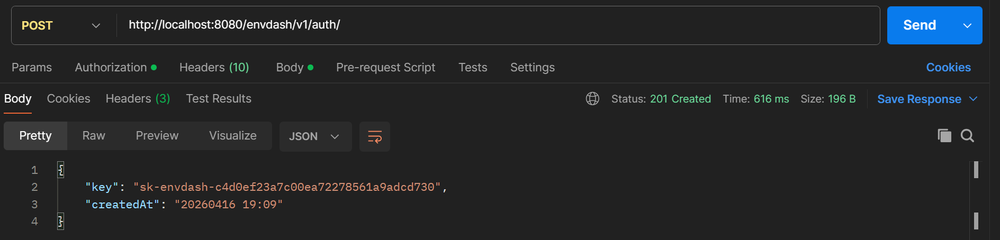

# Authentication

###  Advanced Task
Added authentication with Firestore as the storage backend. Implemented middleware that protects all routes except the status and authentication endpoints. Strictly speaking, this is not full middleware because it does not wrap every route, and it may introduce serious routing issues since delete authorization performs its own API key validation separately

### Why authenticate?
You should authenticate to get your own API key.  
You will need an API key to access this service.

You do **not** need your own API key to:
- Check the status of upstream APIs  
- Register a new user  

You can register up to 5 keys for your user(email).

---

### Getting authenticated
<details>
<summary> <h2> POST endpoint </h2> </summary>

Simply **POST** your name and email in JSON format to `/auth/`. 

Example URL:
`POST xxxxx:8080/envdash/v1/auth/`
Body:
``` json
{
  "name": "Alice",
  "email": "alice@mail.com"
}
```
| Fields      | Value: Type | Description                 |
|:-----------|:------------|:----------------------------|
| `name` | `string`        | *Required*  |
| `email`    | `string`    | *Required*. Need to contain "@"   |

#### Response:

| Status Code   |
|:--------------|
| `201 Created` |

You will then receive an API key:
``` json
{
  "key": "sk-envdash-YourAPIkey...",
  "createdAt": "20260317 20:32"
}
```

| Fields      | Description                 |
|:----------- |:----------------------------|
| `key`       | Your personal API key  |
| `createdAt` | When the API key was created     |


</details>


<details>
<summary> <h2> DELETE endpoint </h2> </summary>

Simply **DELETE** your api key using api you want to delete in url . 

Example URL:
`DELETE xxxxx:8080/envdash/v1/auth/sk-envdash-YourAPIkey`

| Header      | Value: Type | Description                 |
|:-----------|:------------|:----------------------------|
| `x-api-key` | {YourAPIkey}       | Needs to be an api key from the same user. You have to be allowed to delete the key. You can delete your own key asswell |


#### Response:

| Status Code   |
|:--------------|
| `204 No Content` |

When you get the 204, you know that the api key is deleted.
If you receive any other status code, the API key was not deleted.
You will get a helpfull error message, try using that to understand
why the key cant be deleted.

</details>


---

### Using your API key
You must include your API key in all requests to this service.  
This allows the server to identify you without requiring login each time.

Example usage, and Postman:



---

### Dependencies
API key storage depends on Firebase. Firebase is used to securely store keys.

If the `/status` endpoint returns anything other than 200 for the Firebase column, API authentication will not work since the apis are stored persistently in Firestore.

---

### How the server creates API keys (Security)
API keys are generated using a hash of:
- The registered email  
- The exact time the key is created  
- Random number

This makes duplicate keys extremely unlikely and allows users to create multiple keys safely.

### How keys are stored on the server (security, scalability)
Our database is designed to efficiently handle multiple users.

We maintain a global collection called all_api_keys that enables fast lookups and I/O operations.
Each API key is stored as a password using a SHA-256 hash, never in cleartext.

Linking users to other functionality

User data is stored in a users collection. Each user document contains several subcollections:

API keys, used to count how many keys each user owns (insted of counting EVRY api key then returning a number..)

Notifications are linked to the user account.

Authentication ensures that each user can only view and delete their own notifications, and the return from:
` GET /registrations/ ` shos only its own api keys. Authentification is used in enforcing strict access control and data isolation.